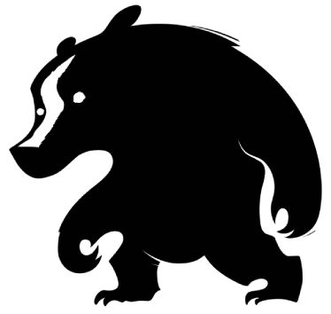

<p align="center">
  
</p>

# Beast of the East Campervans

This isa web application for Beast of the East Campervans ltd, a campervan rental service in Scotland.

The application is built with RedwoodJS, Theme-UI and CSS.gg.

### Setup

The application is built with yarn

```terminal
yarn install
```

### Fire it up

```terminal
yarn redwood dev
```

Your browser should open automatically to `http://localhost:8910` to see the web app. Lambda functions run on `http://localhost:8911` and are also proxied to `http://localhost:8910/.redwood/functions/*`.

## Redwood Resources

- [Tutorial](https://redwoodjs.com/tutorial/welcome-to-redwood): getting started and complete overview guide.
- [Docs](https://redwoodjs.com/docs/introduction): using the Redwood Router, handling assets and files, list of command-line tools, and more.
- [Redwood Community](https://community.redwoodjs.com): get help, share tips and tricks, and collaborate on everything about RedwoodJS.

## Theme UI Resources

- [Getting started](https://theme-ui.com/getting-started)
- [Components](https://theme-ui.com/components)

## CSS.GG Resources

- [Getting started](https://github.com/astrit/css.gg#get-started)
